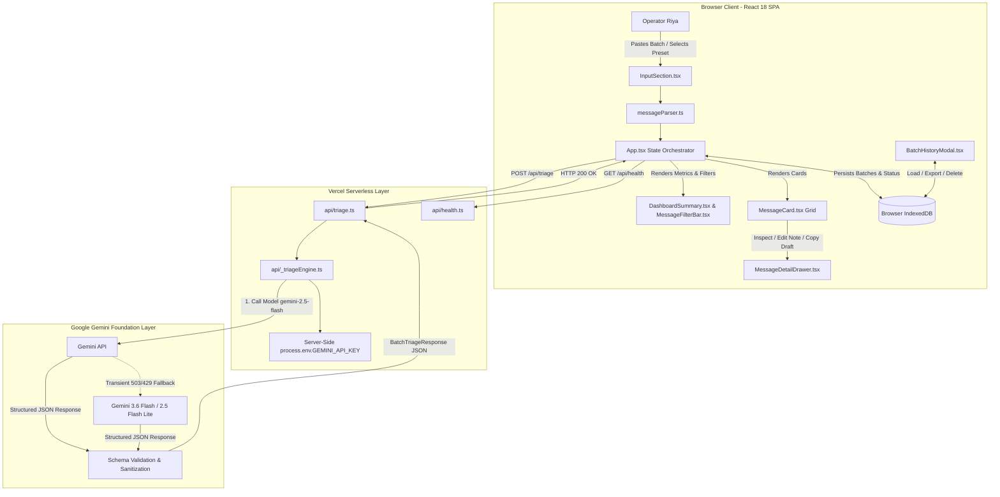
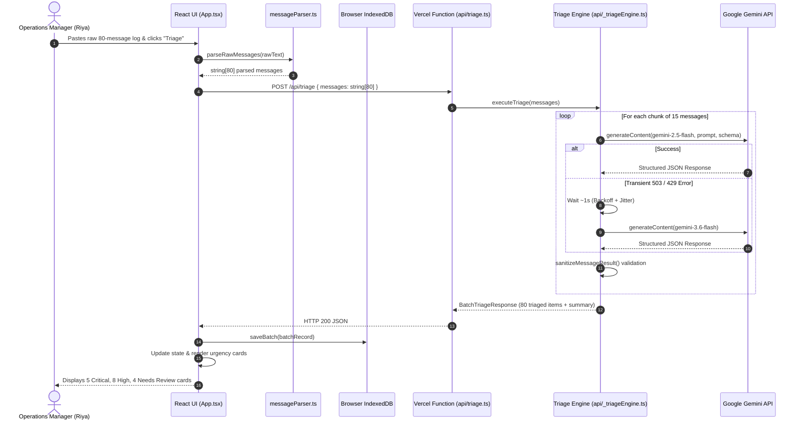
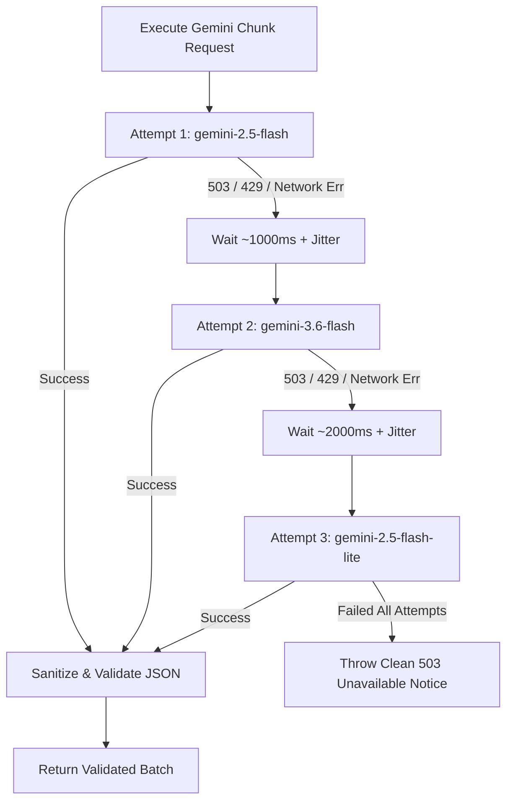

# Technical Architecture Documentation

## System: Smart Inbox Triage
**Framework:** React 18, TypeScript, Tailwind CSS v4, Vercel Serverless, Google Gen AI SDK  
**Persistence:** Browser IndexedDB (`smart_inbox_triage_db`)  
**Deployment Target:** Vercel (Edge/Serverless Network)  

---

## 1. High-Level Architecture Diagram



---

## 2. Component & Module Architecture

### 2.1 Frontend Components (`src/components/`)
- **`App.tsx`**: Central state controller coordinating message parsing, serverless API communication, IndexedDB persistence, active filter application, drawer selection, and batch management.
- **`InputSection.tsx`**: Raw text input textarea supporting direct paste, CSV/text file drag-and-drop, character counts, and quick-load demo presets.
- **`DashboardSummary.tsx`**: Top-level metric cards displaying counts for `Total`, `Critical`, `High`, `Medium`, `Low`, and `Needs Review` with one-click filter triggers.
- **`MessageFilterBar.tsx`**: Granular filtering controls for Priority, Category, Confidence, and Status (`pending`, `reviewed`, `actioned`, `dismissed`), alongside a debounce-assisted keyword search bar.
- **`MessageCard.tsx`**: Individual triage card showcasing urgency badges, category tags, confidence indicators, reason summaries, evidence chips, and quick-action buttons.
- **`MessageDetailDrawer.tsx`**: Slide-over deep-dive panel enabling side-by-side inspection of original text, reason, evidence, recommended action, editable draft reply, and operator custom notes.
- **`BatchHistoryModal.tsx`**: Historical batch viewer allowing Riya to inspect previously saved triage sessions, export data as CSV/JSON, or clear local storage.
- **`GuideModal.tsx`**: Embedded documentation modal explaining the 5-tier classification framework and triage heuristics.
- **`Navbar.tsx`**: Header component featuring brand identity, connection status indicator, and quick-access triggers for history and guide modals.
- **`ProgressIndicator.tsx`**: Animated visual progress bar showing AI analysis state during batch processing.

### 2.2 Utility Modules (`src/lib/`)
- **`messageParser.ts`**: Intelligent parser that converts messy unstructured text into clean string arrays by handling:
  - Blank-line separated blocks (`\n\n`)
  - Numbered lists (`1.`, `2.`, `[1]`, `(1)`)
  - WhatsApp timestamp headers (`[09:12 AM] Driver: ...`)
  - Bulleted points (`-`, `*`, `•`)
- **`indexedDb.ts`**: Production IndexedDB wrapper managing three object stores:
  - `batches`: Metadata, timestamp, title, summary stats, and message arrays.
  - `messages`: Indexed by `batch_id`, `priority`, `category`, and `status`.
  - `activity_logs`: Timestamped audit trail of triage runs, status updates, and note edits.

### 2.3 Serverless Backend (`api/`)
- **`api/_triageEngine.ts`**: Shared TypeScript module containing the Gemini system instruction, response schema, validation rules, 15-message batch chunker, exponential backoff handler, and model fallback controller.
- **`api/triage.ts`**: Vercel Serverless Function entrypoint (`POST /api/triage`) with `maxDuration: 60`, CORS preflight handling, and error masking.
- **`api/health.ts`**: Vercel Serverless Function entrypoint (`GET /api/health`) reporting system status and confirming `GEMINI_API_KEY` configuration.

### 2.4 Local Development Server (`server.ts`)
- Standalone Express 4 application importing `executeTriage` from `./api/_triageEngine.js` and mounting Vite middleware for unified local development (`npm run dev`) and container execution.

---

## 3. End-to-End Request Lifecycle



---

## 4. Security & Data Privacy Architecture

- **Zero Client-Side Secret Exposure:** The Google Gemini API key is never bundled in frontend code or exposed via `import.meta.env`. It is accessed strictly server-side through `process.env.GEMINI_API_KEY`.
- **Zero Server-Side Storage:** The Vercel serverless layer is completely stateless. No operational messages, customer names, or phone numbers are written to server disks or remote databases.
- **Local Data Sandbox:** All persistent data resides within the user's browser IndexedDB sandbox, ensuring compliance with data privacy expectations.

---

## 5. Resilience & Fault-Tolerance Architecture



---

## 6. Architecture Decision Records (ADRs)

| Decision | Context & Need | Benefit | Trade-off | Future Evolution |
| :--- | :--- | :--- | :--- | :--- |
| **ADR-01: Shared Triage Engine** | Keep local development (`server.ts`) and Vercel serverless functions (`api/*.ts`) in sync. | Single source of truth for prompts, schemas, and retries. | Requires explicit ESM `.js` import specifiers. | Extract into internal `@workspace/core` package if microservices are added. |
| **ADR-02: Client-Side IndexedDB** | Store batches and user notes without spinning up costly cloud databases. | Zero cloud hosting cost; complete operator privacy; offline-tolerant storage. | Data does not sync across multiple devices or operators. | Add optional remote PostgreSQL / Firebase sync in Phase 3. |
| **ADR-03: 15-Item Chunking** | Processing 80+ messages in a single AI prompt risks timeout and token truncation. | Fast parallelizable throughput; protects against single-message parse failure. | Multiple API calls per large batch. | Implement dynamic token-aware adaptive chunk sizing. |
| **ADR-04: Multi-Model Fallback** | Production Gemini API spikes (HTTP 503) cause transient failures. | 99.9% resilience during morning peak hours. | Minor variation in latency across fallback models. | Add automated multi-region failover. |

---

## 7. Current vs. Future Architecture

```text
CURRENT ARCHITECTURE (MVP):
[Raw Input] -> [React Client] -> [POST /api/triage] -> [Vercel Function] -> [Gemini API] -> [IndexedDB]

FUTURE ARCHITECTURE (Production Scaled):
[WhatsApp Webhook / Gmail IMAP] 
         │
         ▼
[Message Ingestion Pipeline (Cloud Run / PubSub)]
         │
         ▼
[Centralized Triage Engine + TMS Connector]
         │
         ▼
[PostgreSQL Database (Multi-Tenant & Audited)]
         │
         ▼
[Real-Time Operations Dashboard (WebSockets)]
```
