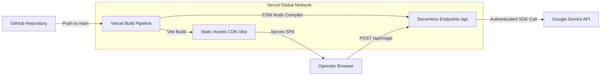

# Production Deployment & Operations Guide

## Platform: Vercel Serverless + Google Gemini API
**Project:** Smart Inbox Triage  
**Runtime:** Node.js 20.x (ESM)  
**Frontend Output:** Static SPA (`dist/`)  
**Backend Output:** Vercel Serverless Functions (`api/*.ts`)  

---

## 1. Deployment Architecture Overview



---

## 2. Prerequisites
1. **GitHub Account:** Access to the project repository.
2. **Vercel Account:** Free or Pro tier.
3. **Google AI Studio Account:** An active API key with access to `gemini-2.5-flash`.

---

## 3. Environment Variables Configuration

The application requires exactly **one server-side secret**:

| Variable Name | Required | Description | Scope |
| :--- | :--- | :--- | :--- |
| `GEMINI_API_KEY` | **Yes** | Google Gemini API Key from Google AI Studio | Serverless Functions Only (Never exposed to client) |

> [!CAUTION]
> Never prefix this variable with `VITE_`. Prefixing with `VITE_` would expose the secret to client-side browser bundles.

---

## 4. Vercel Configuration Settings

When importing the project into the Vercel Dashboard, configure the following project settings:

- **Framework Preset:** `Vite`
- **Root Directory:** `./`
- **Build Command:** `npm run build`
- **Output Directory:** `dist`
- **Install Command:** `npm install`
- **Node.js Version:** `20.x`

### `vercel.json` Specification
The repository includes a root `vercel.json` enforcing proper API routing and Single Page Application (SPA) rewrites:

```json
{
  "framework": "vite",
  "rewrites": [
    {
      "source": "/api/(.*)",
      "destination": "/api/$1"
    },
    {
      "source": "/(.*)",
      "destination": "/index.html"
    }
  ]
}
```

---

## 5. Deployment Step-by-Step

1. **Push Changes to GitHub:**
   Ensure all local changes are committed and pushed to your GitHub repository.

2. **Import into Vercel:**
   - Navigate to [Vercel Dashboard](https://vercel.com/dashboard) → **Add New Project**.
   - Select the GitHub repository.

3. **Set Environment Variables:**
   - Under **Environment Variables**, enter:
     - **Key:** `GEMINI_API_KEY`
     - **Value:** `AIzaSy...your_gemini_api_key`
   - Apply to **Production**, **Preview**, and **Development** environments.

4. **Trigger Deployment:**
   - Click **Deploy**. Vercel will execute `npm run build`, bundle the Vite SPA into `dist/`, and compile the serverless functions in `api/`.

---

## 6. Post-Deployment Verification

### 1. Verify Health Endpoint
Open a terminal or browser and query the health route:
```bash
curl https://your-deployment-url.vercel.app/api/health
```

Expected Response:
```json
{
  "status": "ok",
  "hasApiKey": true,
  "timestamp": "2026-08-16T..."
}
```

### 2. Verify End-to-End Triage
Submit a test operational message to the triage endpoint:
```bash
curl -X POST https://your-deployment-url.vercel.app/api/triage \
  -H "Content-Type: application/json" \
  -d '{"messages": ["[09:12 AM] Driver Ramesh: Axle broke near Panvel bypass. Road blocked."]}'
```

Expected Response: HTTP 200 with `priority: "critical"` and `category: "vehicle_breakdown"`.

---

## 7. Troubleshooting & Diagnostic Guide

| Symptom | Probable Cause | Resolution |
| :--- | :--- | :--- |
| **`hasApiKey: false` in `/api/health`** | `GEMINI_API_KEY` is not configured in Vercel. | Go to Vercel Project Settings → Environment Variables, add `GEMINI_API_KEY`, and trigger a redeploy. |
| **`Cannot find module ... _triageEngine`** | ESM extensionless import resolution mismatch. | Ensure all internal imports in `api/*.ts` use explicit `.js` extensions (e.g. `import { executeTriage } from './_triageEngine.js'`). |
| **HTTP 503 "Gemini is temporarily unavailable"** | Google API experiencing global capacity pressure. | The engine automatically executes 3-tier exponential backoff and model fallbacks. If persistent, wait 1-2 minutes or verify API quota in Google Cloud Console. |
| **Frontend loads but triage hangs** | Serverless function timeout on massive batch (>150 messages). | Keep batch sizes <=150 messages. Verify `api/triage.ts` exports `export const config = { maxDuration: 60 };`. |
| **Page refresh returns 404** | Missing SPA rewrite rule. | Ensure `vercel.json` contains the rewrite rule routing `/(.*)` to `/index.html`. |

---

## 8. Rollback Procedure

If an unexpected regression occurs in production:
1. In the Vercel Dashboard, go to the **Deployments** tab.
2. Locate the last known healthy deployment.
3. Click the **•••** menu next to that deployment and select **Instant Rollback**.
4. Vercel will instantaneously route global traffic back to the prior deployment artifact without rebuilding.
