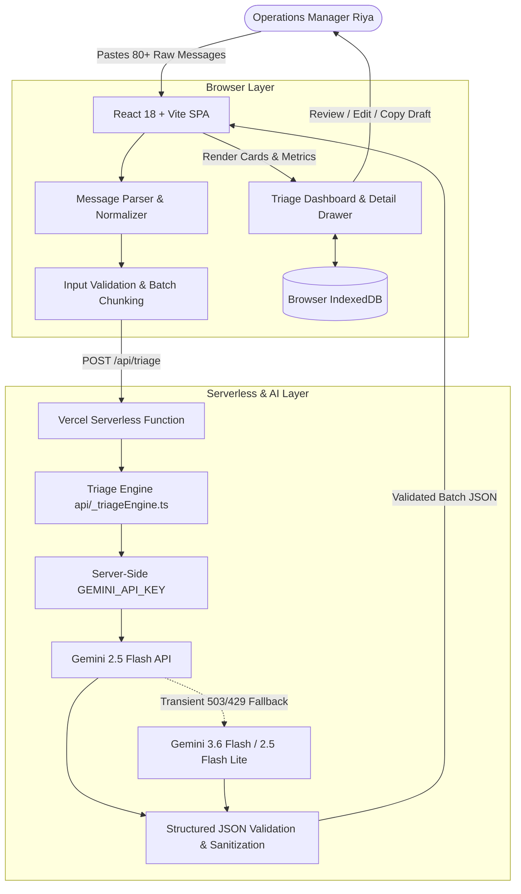

# Smart Inbox Triage

> **AI-assisted operations decision-support system that reduces logistics inbox triage from 60+ minutes to under 3 minutes.**

[](https://vitejs.dev/)
[](https://react.dev/)
[](https://tailwindcss.com/)
[](https://ai.google.dev/)
[](https://vercel.com/)

---

## 1. Executive Summary & Business Problem

In fast-paced middle-mile and last-mile logistics operations, coordination occurs across unorganized communication streams—primarily WhatsApp groups and dispatch emails. 

By 10:00 AM every morning, **Riya**, an Operations Manager at a 50-person logistics startup, faces **80+ unread operational messages** containing:
- **Severe emergencies:** Axle breakdowns, blocked highways, temperature spikes in cold-chain reefers, stalled drivers in waterlogged streets.
- **Time-sensitive escalations:** Customer delivery deadlines, missing e-way bills, checkpost detentions, address changes.
- **Medium/Low updates:** Rescheduling requests for tomorrow, completed delivery proofs (PODs), tyre maintenance invoices.
- **Ambiguous pings:** Vague 3-word driver texts like *"Sir problem with delivery"*, *"Truck issue. Please check"*, or *"Customer is angry"*.

### The Bottleneck
Manually reading and evaluating each unstructured message takes **60 to 90 minutes**, creating severe operational latency. Critical breakdowns get buried beneath routine delivery confirmations, resulting in missed delivery windows, SLA penalties, and customer churn.

### The Solution: Smart Inbox Triage
Smart Inbox Triage is an **AI-assisted decision-support dashboard** that parses messy message batches, evaluates operational impact using Google Gemini, extracts verbatim evidence, provides recommended next steps, generates editable draft replies, and flags ambiguous messages for human review.

---

## 2. Key Capabilities

- **Intelligent 5-Tier Urgency Classification:**
  - `Critical`: Immediate operational disruptions, safety hazards, cold-chain excursions, blocked transit.
  - `High`: Significant delays (>1hr), imminent SLA breaches, customs/checkpost detentions.
  - `Medium`: Non-immediate actions, next-day reschedule requests, invoice queries.
  - `Low`: Routine confirmations, successful PODs, informational updates.
  - `Needs Review`: Vague, incomplete, or low-confidence messages where critical details are missing.
- **Explainability by Design:** Every classification includes a plain-language operational reason and verbatim supporting quotes extracted directly from the original message.
- **Actionable Decision Support:** Concrete next operational steps tailored for Riya, paired with pre-generated, professional draft responses.
- **Anti-Hallucination Guardrails:** The AI is strictly constrained against inventing order IDs, customer names, ETAs, or financial compensation promises.
- **Human-in-the-Loop Workflow:** AI recommends; humans decide. Replies can be inspected, edited, and copied for manual transmission. No autonomous message sending.
- **Resilient AI Pipeline:** Automatic exponential backoff, jitter, and automated model fallback across `gemini-2.5-flash`, `gemini-3.6-flash`, and `gemini-2.5-flash-lite` to mitigate transient provider outages.
- **Zero-Cloud-Storage Local Persistence:** Instant client-side persistence in IndexedDB with batch history, status tracking (`pending`, `reviewed`, `actioned`, `dismissed`), and CSV/JSON export.

---

## 3. High-Level Architecture



---

## 4. Technology Stack

| Domain | Technology | Purpose |
| :--- | :--- | :--- |
| **Frontend Framework** | React 18.3 + TypeScript | Component-based reactive user interface |
| **Build Tool** | Vite 6.1 | Fast HMR and optimized static production bundling |
| **Styling** | Tailwind CSS v4 | Clean, high-density utility styling and layout |
| **Icons & Animation** | Lucide React + Motion | Vector iconography and smooth micro-interactions |
| **Client Storage** | Browser IndexedDB | Client-side batch persistence, audit log, zero server data retention |
| **Serverless Backend** | Node.js ESM + `@vercel/node` | Serverless API hosting on Vercel (`POST /api/triage`, `GET /api/health`) |
| **Local Dev Server** | Express 4 + tsx | Full-stack container and local development server |
| **AI SDK** | `@google/genai` (v0.1.2) | Official Google Gen AI SDK for structured outputs |
| **Primary AI Model** | `gemini-2.5-flash` | Ultra-fast, low-latency reasoning and categorization |
| **Fallback AI Models**| `gemini-3.6-flash`, `gemini-2.5-flash-lite` | Automated fallback models for transient capacity spikes |

---

## 5. Project Directory Structure

```text
smart-inbox-triage/
├── api/                        # Vercel Serverless Functions
│   ├── _triageEngine.ts        # Centralized Gemini prompt, schema, retry & fallback engine
│   ├── health.ts               # GET /api/health endpoint
│   └── triage.ts               # POST /api/triage endpoint
├── src/                        # React Frontend
│   ├── components/             # Modular UI Components
│   │   ├── BatchHistoryModal.tsx   # Saved batch manager & export
│   │   ├── DashboardSummary.tsx    # Urgency metric cards & status filters
│   │   ├── GuideModal.tsx          # System guide & triage framework
│   │   ├── InputSection.tsx        # Raw message input, parser & presets
│   │   ├── MessageCard.tsx         # Triage card with urgency badges
│   │   ├── MessageDetailDrawer.tsx # Deep inspection drawer, note taker & reply editor
│   │   ├── MessageFilterBar.tsx    # Priority, category & text search controls
│   │   ├── Navbar.tsx              # Application header & system health
│   │   └── ProgressIndicator.tsx   # Batch processing progress feedback
│   ├── data/
│   │   └── sampleBatches.ts    # 80-message morning rush, breakdown, and escalation presets
│   ├── lib/
│   │   ├── indexedDb.ts        # IndexedDB storage layer (batches, messages, audit logs)
│   │   └── messageParser.ts    # Multi-format message parser (WhatsApp, numbered, lines)
│   ├── types.ts                # TypeScript domain models and interfaces
│   ├── App.tsx                 # Core application orchestration
│   ├── main.tsx                # React entry point
│   └── index.css               # Global styling
├── server.ts                   # Express development & container server
├── vercel.json                 # Vercel SPA rewrites & serverless routing
├── package.json                # Dependencies and build scripts
├── tsconfig.json               # TypeScript compiler configuration
├── .env.example                # Environment variable documentation
└── README.md                   # Repository documentation
```

---

## 6. Local Development & Setup

### Prerequisites
- Node.js 20.x or higher
- A Google Gemini API Key ([Google AI Studio](https://aistudio.google.com/))

### Installation Steps

1. **Clone the repository:**
   ```bash
   git clone https://github.com/your-org/smart-inbox-triage.git
   cd smart-inbox-triage
   ```

2. **Install dependencies:**
   ```bash
   npm install
   ```

3. **Configure Environment Variables:**
   Copy `.env.example` to `.env`:
   ```bash
   cp .env.example .env
   ```
   Add your Gemini API Key to `.env`:
   ```env
   GEMINI_API_KEY=AIzaSy...your_gemini_api_key_here
   ```

4. **Start the local development server:**
   ```bash
   npm run dev
   ```
   The application will start on `http://localhost:3000`.

5. **Verify Health:**
   Visit `http://localhost:3000/api/health` in your browser. It should return:
   ```json
   {
     "status": "ok",
     "hasApiKey": true,
     "timestamp": "2026-08-16T..."
   }
   ```

---

## 7. Production Deployment (Vercel)

The codebase is natively configured for Vercel deployment with serverless functions and SPA routing.

1. **Import the repository into Vercel.**
2. Set the **Framework Preset** to `Vite`.
3. Set the **Build Command** to `npm run build`.
4. Set the **Output Directory** to `dist`.
5. Under **Settings → Environment Variables**, add:
   - `GEMINI_API_KEY`: Your Google Gemini API key.
6. Deploy! Vercel will automatically compile the frontend SPA and provision the serverless endpoints in `/api`.

---

## 8. API Specifications

### `POST /api/triage`
Processes an array of raw operational message strings and returns a structured triage response.

- **Request Body:**
  ```json
  {
    "messages": [
      "[09:12 AM] Driver Ramesh (MH-04-GP-2819): Axle broke near Panvel bypass. Road blocked.",
      "[09:20 AM] Driver Vikas: Sir problem with delivery."
    ]
  }
  ```

- **Response Body (200 OK):**
  ```json
  {
    "batch_summary": {
      "total_messages": 2,
      "critical_count": 1,
      "high_count": 0,
      "medium_count": 0,
      "low_count": 0,
      "needs_review_count": 1
    },
    "messages": [
      {
        "id": "msg-1771234567-1",
        "original_message": "[09:12 AM] Driver Ramesh (MH-04-GP-2819): Axle broke near Panvel bypass. Road blocked.",
        "priority": "critical",
        "category": "vehicle_breakdown",
        "confidence": "high",
        "reason": "Axle breakage blocks the vehicle and the road, creating an immediate operational disruption.",
        "evidence": ["Axle broke near Panvel bypass", "Road blocked"],
        "recommended_action": "Dispatch emergency towing crane to Panvel bypass and notify the receiver of vehicle delay.",
        "requires_action": true,
        "draft_reply": "Received Ramesh. Dispatching towing crane to Panvel bypass immediately. Please stay safe off the roadway."
      },
      {
        "id": "msg-1771234567-2",
        "original_message": "[09:20 AM] Driver Vikas: Sir problem with delivery.",
        "priority": "needs_review",
        "category": "delivery_issue",
        "confidence": "low",
        "reason": "Vague report of a delivery problem without order number, specific issue, or location.",
        "evidence": ["Sir problem with delivery"],
        "recommended_action": "Request specific order details and description of the delivery issue from driver Vikas.",
        "missing_information": ["Order or Docket Number", "Nature of problem", "Current location"],
        "requires_action": true,
        "draft_reply": "Hi Vikas, please send the order number, customer name, and what specific issue you are facing so we can help."
      }
    ]
  }
  ```

### `GET /api/health`
Health check endpoint reporting service availability and API key presence.

- **Response Body (200 OK):**
  ```json
  {
    "status": "ok",
    "hasApiKey": true,
    "timestamp": "2026-08-16T08:00:00.000Z"
  }
  ```

---

## 9. Demo Flow & Presets

To test the system immediately without manual message composition, click any of the built-in preset chips in the input section:
1. **Full Morning Rush (80 Messages):** A realistic 10 AM operations queue with 14 breakdowns/emergencies, 18 high-priority escalations, routine PODs, and ambiguous driver texts.
2. **Critical Breakdowns & Escalations (10 Messages):** High-stress scenario containing cold-chain temperature excursions, axle failures, and angry client escalations.
3. **Ambiguous Driver Pings (6 Messages):** Demonstrates the `Needs Review` classification, showing how the AI isolates missing information rather than hallucinating answers.
4. **Routine & Confirmations (8 Messages):** Low-priority batch demonstrating clean separation of informational noise.

---

## 10. Known Limitations (MVP Scope)

- **Manual Ingestion:** Input currently relies on raw text paste, CSV upload, or demo presets. Direct WhatsApp Webhook and Gmail IMAP synchronization are not implemented in this MVP.
- **Manual Transmission:** Draft replies must be copied and sent manually by the operator. Direct outgoing API messaging is intentionally excluded to preserve human oversight.
- **Single-Client Persistence:** Data is stored in browser IndexedDB. Cross-device multi-user synchronization is not included in the MVP.
- **Batch Size Limit:** The engine is optimized for batches up to 150 messages per submission (chunked into 15-message API payloads).

---

## 11. Future Roadmap

- [ ] **Phase 2 — Direct Channel Integrations:** Direct WhatsApp Business API webhook listener and Gmail/Outlook OAuth ingestion.
- [ ] **Phase 3 — Real-Time TMS Connector:** Live integration with Transport Management Systems (Shipsy, FarEye, Locus) to cross-reference order IDs and driver rosters automatically.
- [ ] **Phase 4 — Team Collaboration & RBAC:** Multi-user backend with role-based access control, shift handovers, and operator audit trails.
- [ ] **Phase 5 — Voice-to-Text Driver Notes:** Automatic transcription and translation of regional voice notes (Hindi, Marathi, Tamil) into structured triage cards.
